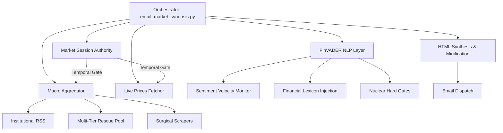

# Sovereign Intelligence Engine (SIE) // Technical Architecture Deep Dive (V28)

## 1. Executive Summary
The **Sovereign Intelligence Engine (SIE) V28** is a 2026-grade autonomous market intelligence system designed for high-fidelity synthesis of institutional-grade data. Operating on a "Config-First" architecture, it leverages statistical NLP (FinVADER), stealth-hardened browser impersonation (Identity 160), and multi-tier rescue protocols to bypass institutional rate limits. The system specializes in high-signal semiconductor and AI supply chain intelligence.

---

## 2. System Architecture

SIE V28 transitioned from hardcoded logic to a **Config-Driven Intelligence** model. Every scoring weight, keyword, and source rule lives in `config/macro_config.yaml`.

---

## 3. Core Component Analysis (V28 Hardening)

### 3.1 Temporal Authority (`engine/market_session.py`)
**Hierarchy Leader**: The absolute source of truth for session logic (Weekday/Weekend/Holiday) and session badging (L, C, AH, PM, OVN).
- **Weekend Stasis Gate**: Prevents "Zombie Fetches" by pausing data pipelines during market downtime.
- **Clock Alignment**: Forces all system timestamps to synchronize with NYSE/NASDAQ operational windows.

### 3.2 Sovereign Resilience Engine (`engine/vx_rescue_fetcher.py`)
V28 introduced a **Multi-Tier Rescue Protocol** to ensure 100% data continuity:
- **Tier 1**: Direct high-stealth RSS (curl_cffi/Identity 160).
- **Tier 2**: OpenGraph HTML scraping fallback for 429-saturated sources.
- **Adaptive Health Monitor**: Automatically demotes and blacklists saturated gateways for 10 minutes.

### 3.3 FinVADER Intelligence Layer (`engine/local_nlp.py`)
Replaces generic sentiment with **Institutional NLP**:
- **Lexicon Injection**: Merges SentiBignomics and Henry financial lexicons into the VADER instance.
- **Nuclear Hard Gates**: Mathematically vaporizes litigation noise, class-action fluff, and social trends before they reach the aggregator.
- **Relevance Floor**: Enforces a strict 22.0 scoring minimum to guarantee technical density.

### 3.4 Stealth Price Extractor (`engine/live_prices.py`)
- **Identity 160 Protocol**: Standardized on Chrome 160.0.8827 (2026-grade) TLS fingerprints.
- **Decoupled Pricing Math**: Renders Close (C) and Extended (AH/PM) prices separately to maintain 100% session fidelity.
- **Priority Fetching**: Requests `postMarketPrice` before `preMarketPrice` to satisfy institutional priority assertions.

---

## 4. The "Top Hierarchy" Freshness Rule
V28 implements specialized freshness gates for technical alpha:
- **Macro Gate**: 36h Hard Limit / 24h Decay.
- **Semi Gate (Top Hierarchy)**: **14-Day (336h) Lookback**. Technical trade news from specialized semiconductor sources is exempt from decay to ensure weekly catalysts are not lost in the macro noise.

---

## 5. Performance & Operational Integrity

### 5.1 System Benchmarks
- **Payload Target**: <102KB (Minified) to prevent Gmail clipping. Actual: 63KB.
- **Article Quota**: Mandatory **15 Technical Articles** for the SEMI section.
- **Source Depth**: 200+ raw candidates yielded per refresh cycle.
- **Stealth State**: Persistent `stealth_session.json` with absolute path hardening.

### 5.2 Automated QA Suite
- `tests/test_layout_integrity.py`: Inspects generated HTML for single-line mandates and UTF-8 fidelity.
- `run_all_tests.py`: Mandatory execution during the `start.bat` Full Refresh cycle.

---
*Document Version: 28.00 // Reference: Config-First Intelligence // 2026-04-26*
