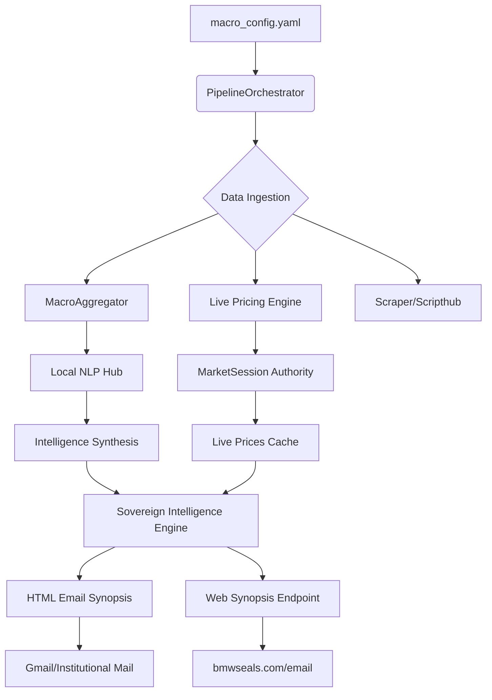

# ARCHITECTURE V28.8: Sovereign Intelligence Engine

## Executive Summary
The **GIGACPO Sovereign Intelligence Engine (V28.8)** is an autonomous market intelligence platform designed to identify high-alpha opportunities in the Co-Packaged Optics (CPO) and Silicon Photonics (SiPh) supply chain. It synthesizes institutional-grade news, real-time pricing data, and statistical NLP insights into a high-density "Cockpit" UI, dispatched via email and web endpoints.

### V28.8 Core Milestones
- **Dual-Dispatch**: Simultaneous deployment to email and `bmwseals.com/email`.
- **Config-First Intelligence**: All scoring logic moved to `macro_config.yaml`.
- **FinVADER Sentiment**: Statistical NLP hardened with the Loughran-McDonald financial dictionary.
- **Stealth Ghost Mode**: Multi-tier gateway rescue for bypassing API rate limits.

---

## 🏛️ System Overview

The system operates as a decoupled pipeline governed by a central orchestrator.

---

## 🧩 Core Components

### 1. The Single Source of Truth: `macro_config.yaml`
Located in `config/macro_config.yaml`, this file dictates the engine's intelligence priorities.
- **Scoring Rules**: Multipliers for clusters, billion-scale bonuses, and priority weights.
- **Keyword Lexicon**: 500+ curated terms across Semi, Photonics, and Macro sectors.
- **Feed Management**: Weighted RSS and Scrape sources (CNBC, Reuters, Bloomberg, etc.).

### 2. Intelligence Aggregator: `macro_aggregator.py`
The "Filter" of the system.
- **Async Scraping**: Uses `curl_cffi` with browser impersonation to bypass bot detection.
- **Deduplication**: Employs Jaccard overlap and Entity Intersection to prevent headline repetition.
- **Safety Gates**: Blocks low-signal sources (Motley Fool, Cramer) and interrogative clickbait.

### 3. statistical NLP Hub: `local_nlp.py`
The "Brain" of the system.
- **LSA Summarization**: Latent Semantic Analysis for extractive summarization.
- **FinVADER**: Custom VADER sentiment analysis injected with the Loughran-McDonald financial lexicon.
- **TF-IDF Clustering**: Identifies velocity shifts in keyword frequency across news cycles.

### 4. Session Authority: `market_session.py`
The "Clock" of the system.
- **Temporal Logic**: Absolute authority on Pre-Market (0400), Regular (0930), Post-Market (1600), and Overnight (2000) windows.
- **Stasis Gate**: Prevents "Zombie Fetches" during weekends.

### 5. Pricing Engine: `live_prices.py`
The "Ticker" of the system.
- **Ghost Mode**: High-stealth price extraction in 10-ticker chunks.
- **BOATS Protocol**: Extracts "Overnight" (Blue Ocean ATS) prices hidden from standard APIs.

### 6. Orchestrator: `email_market_synopsis.py`
The "Cockpit" of the system.
- **Liquid UI**: Generates a responsive, high-density HTML dossier.
- **JIT Hydration**: Refreshes prices just-in-time if the cache is older than 300s.
- **Dual-Dispatch**: Pushes results to RemoteSync and SMTP simultaneously.

---

## 💾 Data Models

| Artifact | Role | Storage |
| :--- | :--- | :--- |
| `CPO_MASTER_DATA.json` | Comprehensive asset metadata | `/database/` |
| `live_prices.json` | Real-time session-aware pricing | `/database/` |
| `macro_news_cache.json` | Ranked and scored news items | `/database/` |
| `sent_news_history.json` | 24h ledger of dispatched URLs | `/database/` |

---

## ⚡ Design Philosophy

### 1. Massive Payload Optimization
To prevent Gmail clipping, the engine minifies HTML to <102KB (achieved 63KB in V28.8). This is done by transitioning from inline styles to a centralized `<style>` block and stripping redundant white space.

### 2. Identity Standardization
All extraction requests use a standardized Chrome 146.0.7000 identity. This ensures consistent fingerprinting and reduces 429 (Rate Limit) frequency.

### 3. Decoupled UI Rendering
Ticker tiles are rendered as independent units. This allows the system to scale from a few dozen tickers to 200+ without degrading performance or layout integrity.

---

## 🚀 Operational Workflow

1. **Trigger**: Manual start via `start.bat` or automated 4:20 PM EST sync via `server.py`.
2. **Fetch**: `MacroAggregator` gathers news; `live_prices.py` updates the ticker tape.
3. **Score**: Headlines are ranked based on `macro_config.yaml` and NLP sentiment.
4. **Build**: `SovereignIntelligenceEngine` assembles the HTML dossier.
5. **Dispatch**: Dual-dispatch to Email and Web.
