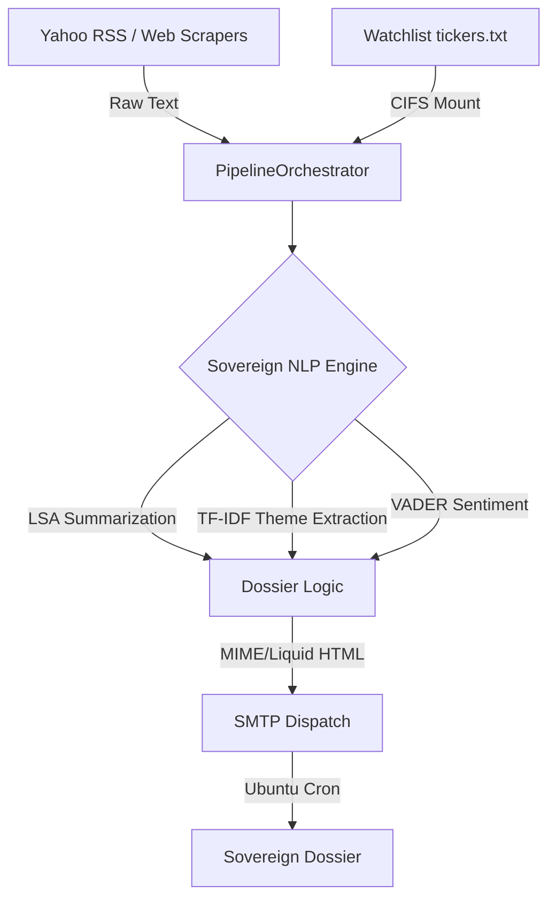

# Sovereign Intelligence Engine: Technical Specification (V23.44)

## 1. System Vision
The Sovereign Intelligence Engine (SIE) is a production-grade, autonomous analytical pipeline designed to convert fragmented financial signals into a high-fidelity "Intelligence Dossier." It operates on the principle of **Zero-Cloud Autonomy**, utilizing local statistical modeling to eliminate recurring API costs and data exposure.

## 2. Architectural Pillars

### A. High-Stealth Ingestion & Orchestration
- **Modular Hub**: `email_market_synopsis.py` acts as the central orchestrator, leveraging `live_prices.py` for all real-time price data and `local_nlp.py` for dossier synthesis.
- **Hybrid Session Locking (V23.44)**: Hardened `get_session_data` logic to prevent gain-reversion during the 4:00 AM CST session transition. The engine now detects "Stale PM" scenarios and holds active `OVN` price data until fresh pre-market trades are confirmed.
- **Ubuntu Pulse Sync**: Operationalized a master-satellite architecture. The intelligence engine runs on a dedicated Ubuntu VM, fetching watchlist state from a CIFS-mounted `tickers.txt` on the Windows host.
- **Granular 15-Minute Protocol (V22.96)**: Implements a hard **15-minute (900s) asset-level TTL cache**. Both static and dynamic discovery hydration are gated by a per-ticker `timestamp` check in `live_prices.json`, preventing redundant fetches for individual assets even when scripts are run in parallel.
- **Session-Aware Pulse (V22.94)**: Uses `get_market_session()` to tag chips with `PM` (Pre), `AH` (After), or `OVN` (Overnight). Integrates high-fidelity BOATS data via `overnightPrice=true`.

### B. Responsive UI Architecture (V22.44)
- **Mobile Lock (< 600px)**: Prioritizes hyper-density and speed. Small typography (9-12px) ensures maximal data visibility on phone screens.
- **Desktop Upsizing (>= 600px)**: Enhances legibility for 4K monitors. Increases section headers to 14-24px and tile values to 20px.

### C. Signal Governance & News Quality (V23.01)
- **Zero-Noise Protocol**: Enforces aggressive signal purging (`is_shite_ticker`) to permanently blacklist stablecoins (`USDC`, `USDT`) and general market metadata (`YAHOO`, `MARKET`, `NEWS`) from the intelligence pipeline.
- **Velocity Spikes Filter**: Velocity Override components require a strict minimum 0.1% volatility move and a 20% ($1.2\times$) volume surge to be considered valid intelligence.
- **NEWS_BLACKLIST**: Automatically purges sensationalist financial commentary (e.g., Jim Cramer / Mad Money) from the synthesis and headline pools.
- **Deduplication Pass**: SHA-256 title-based pruning prevents repetitive news artifacts from biasing the NLP sentiment weights.

### D. Asset Integrity & Data Recovery
- **Intelligence Consolidation**: The dossier eliminates redundant interface elements, unifying Velocity Override strips directly inside the core **Macro // Global Pulse** stream, generating an immersive, continuous narrative block prioritizing deep synthesis (20 sentence dynamic NLP assembly) and Top 15 high-signal headlines.
- **Self-Hydrating Loops**: Every run performs a "Data-Void" scan. Any discovered symbol missing a price is hydrated in a single transactional batch.
- **Entity Recovery**: Corrects misidentified tickers (e.g., CRCL Circle Internet Financial) in the master database.

## 3. Statistical NLP Pipeline (`engine/local_nlp.py`)
- **LSA (Latent Semantic Analysis)**: Transforms the news corpus into a TDM, performs SVD, and ranks sentences by their importance relative to the dominant semantic concepts.
- **TF-IDF Theme Mapping**: Extracts the top active catalysts for the 48-hour window.
- **VADER Sentiment**: Rule-based scoring optimized for market headlines.

## 4. Engineering Roadmap
- [x] **Desktop/Mobile Parity**: Achieved in V22.44.
- [x] **Granular 15-Minute Protocol**: Production-hardened in V22.96.
- [x] **Session Visibility**: Integrated PM/AH tagging in V22.9.
- [x] **BOATS Overnight Integration**: High-fidelity OVN session detection (V22.94).
- [x] **Hybrid Session Locking**: Production-grade 4 AM transition fix (V23.44).
- [x] **Ubuntu Automation Hub**: Scheduled autonomous dispatch (V23.44).
- [ ] **Adaptive Lexicons**: Dynamically update VADER scores based on current "Market Vibe".
- [ ] **Entity-Aware Extraction**: Implement `spacy-lite` to identify unmapped M&A targets.

---
*Autonomous System Status: STABLE*
*Last Protocol Update: 2026-04-20 (V23.01)*
